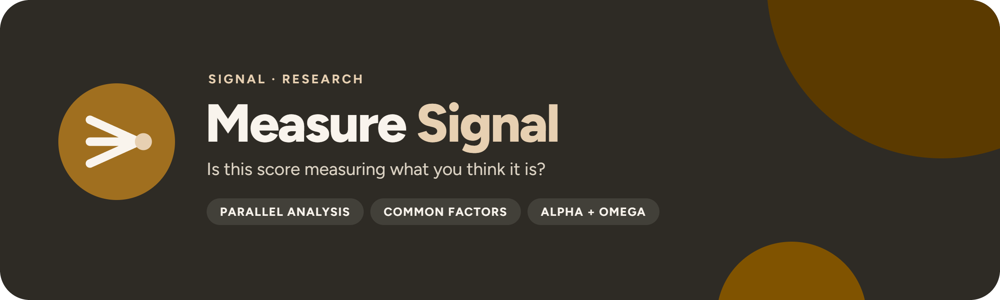

<p align="center">
  
</p>

<p align="center">
  <a href="https://github.com/UlrikErlingsen/measurement-validation/actions"></a>
  <a href="https://github.com/UlrikErlingsen/signal-hub"></a>
  
  
  <a href="LICENSE"></a>
</p>

<p align="center"><strong>Open measurement evidence — define the score, diagnose its structure, freeze the next confirmation.</strong></p>

**Measure Signal** helps researchers, analysts, and insight teams examine whether a multi-item response battery behaves like a defensible measurement instrument in an exploratory sample. It combines a written measurement contract, response and item audit, factorability diagnostics, parallel analysis, common-factor EFA, reliability estimation, transparent scoring recipes, and a reproducible evidence pack.

> Is this score measuring what you think it is?

Everything runs locally with open-source Python packages. There is no account, telemetry, external AI call, remote database, or built-in persistence.

## Read this first

> **The app diagnoses score behavior; it does not manufacture construct validity.** Content coverage, response process, sampling, external relationships, fairness, and independent confirmation remain part of the research program.

Measure Signal never treats high coefficient alpha as proof that items measure one construct. Reliability is a property of scores for a population and use. A factor solution discovered in one sample remains exploratory until its scoring rule is frozen and evaluated on new data.

## Scope

**Version 1.4 supports:**

- wide data with one row per respondent;
- three or more numeric candidate items (50 in the public online demo);
- a declared response minimum and maximum;
- declared reverse keying;
- Pearson or Spearman item correlations;
- complete-case exploratory analysis with missingness retained in the audit;
- overall and item-level KMO plus Bartlett's sphericity statistic;
- Horn-style PCA parallel analysis using a fixed random seed and 95th-percentile benchmark;
- principal-axis common-factor analysis with 1 to 8 planned factors (never more than the item count minus one);
- oblimin rotation and factor correlations for multifactor solutions;
- loading, communality, cross-loading, residual-correlation, and factor-coverage diagnostics;
- raw and standardized alpha, percentile-bootstrap alpha intervals, omega total, and mean inter-item correlation;
- corrected item-total correlations and alpha-if-deleted as sensitivities—not deletion instructions;
- aggregate exploratory mean-score recipes with a declared missing-item rule;
- a declared cross-wave/group comparison intent, group completeness audit, and scalar-invariance evidence gate.

**It does not** estimate CFA, bifactor/higher-order models, polychoric or tetrachoric correlations, categorical latent-variable models, IRT, DIF, measurement invariance, test-retest or inter-rater reliability, survey weights, complex samples, multilevel/longitudinal measurement, imputation, predictive validity, or automated item selection. It records external invariance evidence and withholds cross-wave/group construct-mean comparisons until scalar/threshold evidence and its source are declared; it does not verify that declaration.

Relationships among already defined measures belong in **[Driver Signal](https://github.com/UlrikErlingsen/survey-driver-analysis)**; tracking a documented score across waves belongs in **[Track Signal](https://github.com/UlrikErlingsen/brand-tracking)**.

## Try the demo in three minutes

1. Start the app. The fictional three-factor demo is preloaded; **Load fictional three-factor demo** in the sidebar restores it at any time.
2. Review the saved contract for an entirely fictional 12-item, three-dimension instrument.
3. Open the audit to inspect missingness, endpoint use, range violations, respondent uniqueness, and constant patterns.
4. Read the tracking-comparability gate: the demo intentionally withholds wave comparisons because no scalar-invariance evidence is declared.
5. Run the declared analysis. Compare the planned three factors with the fixed-seed parallel-analysis signal.
6. Inspect the oblimin pattern matrix, factor correlations, cross-loadings, communalities, and residuals.
7. Read alpha with its bootstrap interval beside omega, then review the exploratory scoring recipe.
8. Export the aggregate evidence record as XLSX, CSV-ZIP, or JSON and use it to pre-specify an independent confirmation.

The demonstration is deterministic synthetic data. Its construct, item names, response pattern, and factor structure represent no real respondent, organization, course case, or empirical finding.

## Data contract

Use one row per respondent and one column per item. CSV, XLSX, and JSON are supported.

| respondent_id | item_1 | item_2 | item_3 | item_4_rev |
|---|---:|---:|---:|---:|
| R001 | 6 | 5 | 6 | 2 |
| R002 | 3 | 4 | 3 | 5 |

Keep item columns numeric. Leave missing answers blank. Select reverse-keyed items from the questionnaire key, not because their sample correlations point in an inconvenient direction. See the [data guide](docs/data-guide.md).

## Analysis contract

Before analysis, record the measurement contract:

- construct name, definition, and boundaries;
- target population and administration context;
- intended score use and explicitly excluded uses;
- planned dimensions and theoretical rationale;
- respondent identifier and candidate item columns;
- response endpoints and reverse-keyed items;
- planned factor count and correlation model;
- primary- and cross-loading thresholds;
- use-specific reliability planning target;
- minimum proportion answered for exploratory scoring;
- independent confirmation and validity plan.

These fields keep the analysis from silently redefining the construct around whichever items behave best in the current sample.

The contract page includes an optional **Communication measurement study** starter template (default: Blank). It prefills a four-dimension communication-response contract — awareness, attitude toward the ad, brand attitude and brand fit, and persuasion/purchase intention — with a 1–7 response range, four planned correlated factors (oblique rotation), and standard thresholds, following the advertising-pretesting tradition of MacKenzie and Lutz (1989). It is prefill only: every field stays editable, item selection is never automated, and single-item or near-binary awareness measures should be reported separately rather than forced into the factor battery.

## Methods

### Dimensionality workflow

The app first audits the response table. Modeling is withheld for out-of-range responses, too few complete rows, constant items, or a singular correlation matrix.

Parallel analysis compares observed correlation-matrix eigenvalues with random-data eigenvalues. The declared model is then fitted separately as common-factor analysis using principal-axis extraction. Multifactor solutions use oblimin rotation because forcing psychologically or managerially related dimensions to be uncorrelated is often implausible. The app reports pattern loadings and factor correlations explicitly.

Parallel analysis is evidence, not an oracle. Construct theory, item content, model residuals, factor coverage, interpretability, and independent replication remain relevant.

### Reliability and scoring

The app reports alpha for comparability, a bootstrap interval for sampling uncertainty, and omega total from the fitted common-factor covariance. Alpha and omega answer related but different questions and both depend on assumptions. High values can reflect redundant items or a long scale.

Exploratory factor-score recipes are simple means of items assigned to their strongest factor and meeting the declared loading threshold. This is an auditable proposal, not a finalized instrument. Freeze the recipe and confirm it before operational use.

See [methods](docs/methods.md).

## Decision statuses

- **DATA CHECK REQUIRED:** range or repeated-identifier problems must be resolved.
- **DATA LIMITED:** the bounded complete-sample minimum or KMO does not support a stable exploratory reading.
- **STRUCTURE UNCLEAR:** retention evidence conflicts with the planned factor count, a factor lacks coverage, cross-loading is extensive, or the solution is statistically improper (a Heywood case).
- **RESPECIFY WITH THEORY:** the pattern is readable, but loading or reliability evidence needs construct-led revision.
- **READY FOR HOLDOUT TEST:** the exploratory recipe is coherent enough to pre-specify for new data. This is not a validity certificate.

See the [decision guide](docs/decision-guide.md).

## Exports

Excel, CSV-ZIP, and JSON evidence packs include:

- source filename, sheet, and SHA-256 fingerprint;
- the full measurement contract and software version;
- aggregate item and response audit;
- factorability diagnostics, correlation matrix, and parallel analysis;
- rotated item structure and factor correlations;
- reliability estimates, item-total sensitivities, and aggregate score summaries;
- the evidence-profile status, warnings, and exact reproducibility settings.

Respondent identifiers, answers, and row-level scores are excluded. Exported text is neutralized against spreadsheet-formula interpretation.

## Run locally

You need Python 3.10 or newer and a local copy of this folder.

**macOS:** double-click `run_app.command`. **Windows:** double-click `run_app.bat`.

The first launch creates a private `.venv` and downloads open-source dependencies. Later launches reuse it. Or use a terminal:

```bash
python3 -m venv .venv
source .venv/bin/activate  # Windows: .venv\Scripts\activate
python -m pip install -r requirements.txt
python -m streamlit run app.py
```

Measure Signal prefers local port `8591` and falls back to another free port on macOS. The launchers accept `MEASURESIGNAL_PORT`, `MEASURESIGNAL_MAX_UPLOAD_MB` (Streamlit's upload cap in MB, default 10000), `MEASURESIGNAL_NO_BROWSER`, and `MEASURESIGNAL_DEBUG` environment variables.

### Docker

```bash
docker build -t measuresignal .
docker run --rm -p 8591:8591 measuresignal
```

Then open `http://127.0.0.1:8591`. The container runs as a non-root user. Its upload cap is `STREAMLIT_SERVER_MAX_UPLOAD_SIZE` (MB, default 10000). For a public demo, also set `SIGNAL_PUBLIC=1` to apply the demo limits, e.g. `docker run -e SIGNAL_PUBLIC=1 -e STREAMLIT_SERVER_MAX_UPLOAD_SIZE=50 ...`.

## Data limits

Run locally (standalone, inside a local Signal Hub, or on an internal company server), Measure Signal has **no built-in limit** on file size, respondents, columns, or items: the computer's memory is the limit, and running out of memory produces a plain message instead of a crash. Streamlit's upload cap defaults to 10,000 MB (`MEASURESIGNAL_MAX_UPLOAD_MB`; `STREAMLIT_SERVER_MAX_UPLOAD_SIZE` in Docker). CSV is the fastest format for large files; ratings are stored compactly (one byte per answer on a 1–7 scale) while every statistic runs in double precision.

The audit, correlations, KMO/Bartlett, the factor solution, alpha, omega, item diagnostics, and scoring use every complete row; above 1,000,000 complete rows they come from one item covariance matrix accumulated in chunks (same estimates, a fraction of the memory). Two simulation steps use large-sample methods, labelled in the warnings, diagnostics, and evidence pack:

- above 20,000 complete rows, parallel analysis draws its random benchmark from the Wishart distribution of a null correlation matrix instead of simulating every row (identical in distribution for Pearson, the standard large-sample approximation for Spearman);
- when an alpha bootstrap would resample more than 50,000,000 respondent-by-item cells, it resamples a seeded subsample (at least 2,000 rows) and rescales the interval to the full sample by √(m/n); the reliability table records `alpha_bootstrap_rows`.

On the development laptop a 5,000,000-respondent, 204 MB CSV with 12 items loaded in about 4 seconds; the audit took about 6 seconds and the full analysis (499 parallel-analysis and 499 bootstrap replications) about 6 seconds, at roughly 2.4 GB peak memory. Version 1.3 needed about 90 seconds for 250,000 rows.

A public online demo (`SIGNAL_PUBLIC=1`, set by Signal Hub's public image) applies demo limits instead: 50 MB uploads, 250,000 rows, 500 columns, and 50 items. The downloaded app has none of them.

## Privacy

Data entered in the browser is processed by the local Streamlit process and stays there unless you download or otherwise move it. If someone hosts Measure Signal, that operator becomes responsible for transport security, authentication, logs, retention, and applicable privacy obligations. See [PRIVACY.md](PRIVACY.md).

## No install? Give this file to an AI

[AI_ANALYST.md](AI_ANALYST.md) is a standalone analysis protocol for a capable AI assistant. It contains the same scope limits, calculations, and honesty rules. A local app is the more private option: a cloud AI sees whatever you upload or paste.

## Development

```bash
python -m pip install -e ".[test]"
python -m pytest
python -m ruff check .
python -m build
```

The analysis core (`measuresignal`) installs without Streamlit or Plotly; the app needs the `ui` extra (`python -m pip install -e ".[ui]"`), and `requirements.txt` lists everything for the launchers and Docker. [Signal Hub](https://github.com/UlrikErlingsen/signal-hub) embeds the app through `measuresignal.ui.render()`.

The suite checks reverse keying, range and response audits, known synthetic factor recovery, KMO/Bartlett calculations, deterministic parallel analysis, Pearson and Spearman paths, singular-matrix refusal, alpha/omega output, privacy-minimized exports, safe spreadsheet handling, deterministic examples, the shared Signal shell, every Streamlit page, and the Signal Hub contract (no Streamlit or Plotly import outside `ui/`, `render()` without a page config, namespaced keys, no repo-root files at runtime).

## Where this fits in Signal

Measure Signal comes before Driver Signal when a downstream model depends on a composite score. It diagnoses the measure; Driver Signal analyzes relationships among already defined measures.

- **Measure Signal** asks whether a proposed multi-item score has a defensible exploratory measurement structure.
- **[Driver Signal](https://github.com/UlrikErlingsen/survey-driver-analysis)** asks which measured experiences move with satisfaction.
- **[Track Signal](https://github.com/UlrikErlingsen/brand-tracking)** asks whether brand measures moved across tracking waves by more than a declared practical threshold; construct scores it tracks need a recorded measurement-evidence reference such as a Measure Signal record.
- **[Text Signal](https://github.com/UlrikErlingsen/open-text-analysis)** asks what recurring language patterns appear in open-ended responses.

<!-- signal-suite:start (generated from signal-hub/apps.yaml by scripts/sync_readme_suite.py) -->
| Family | App | Asks |
|---|---|---|
| Brand | [Track Signal](https://github.com/UlrikErlingsen/brand-tracking) | Is the brand moving, or is the tracker just noisy? |
| Brand | [Position Signal](https://github.com/UlrikErlingsen/brand-positioning) | Where do brands sit relative to competitors? |
| Market | [Prospect Signal](https://github.com/UlrikErlingsen/b2b-prospecting) | Which Norwegian companies fit your ideal customer, and which first? |
| Market | [Listen Signal](https://github.com/UlrikErlingsen/media-listening) | Who is talking about the brand in Norwegian media, and in what tone? |
| Market | [Influence Signal](https://github.com/UlrikErlingsen/influencer-campaigns) | Which creators delivered, and was every post labelled properly? |
| Market | [Season Signal](https://github.com/UlrikErlingsen/marketing-calendar) | What does the Norwegian marketing year look like, worked backwards? |
| Market | [Adopt Signal](https://github.com/UlrikErlingsen/adoption-forecasting) | When will a new product be adopted? |
| Market | [Rival Signal](https://github.com/UlrikErlingsen/competitor-analysis) | Which rivals matter, and how could they respond? |
| Market | [Reach Signal](https://github.com/UlrikErlingsen/location-catchment-analysis) | Where could a new location reach, and how would it share demand with existing sites? |
| Customer | [Worth Signal](https://github.com/UlrikErlingsen/customer-value-analytics) | What are customers and relationships worth? |
| Customer | [Segment Signal](https://github.com/UlrikErlingsen/customer-segmentation) | Do customers form stable, useful groups? |
| Customer | [Trace Signal](https://github.com/UlrikErlingsen/journey-path-analysis) | How do logged customer journeys actually unfold? |
| Customer | [Blueprint Signal](https://github.com/UlrikErlingsen/service-blueprinting) | How is the customer experience actually delivered, and where do the handoffs fail? |
| Customer | [Recommend Signal](https://github.com/UlrikErlingsen/recommender-evaluation) | Which recommendation policy should be tested live? |
| Research | [Choice Signal](https://github.com/UlrikErlingsen/conjoint-analysis) | How do product attributes drive choice? |
| Research | [Driver Signal](https://github.com/UlrikErlingsen/survey-driver-analysis) | Which measured experiences move with satisfaction? |
| Research | **Measure Signal** (this app) | Does a multi-item score have a defensible structure? |
| Research | [Text Signal](https://github.com/UlrikErlingsen/open-text-analysis) | What recurring patterns appear in open-ended responses? |
| Research | [Tag Signal](https://github.com/UlrikErlingsen/pricing-analysis) | What price range is supported, and how does profit move? |
| Research | [Learn Signal](https://github.com/UlrikErlingsen/research-prioritization) | Which uncertainty is worth paying to research before you decide? |
| Decide | [Experiment Signal](https://github.com/UlrikErlingsen/experiment-analysis) | Did the treatment cause a practically meaningful change? |
| Decide | [Gate Signal](https://github.com/UlrikErlingsen/launch-decision-gate) | Does a concept deserve the next investment? |
| Decide | [Shift Signal](https://github.com/UlrikErlingsen/cannibalization-analysis) | Does a launch grow the portfolio, or move existing demand around? |
| Decide | [Alloc Signal](https://github.com/UlrikErlingsen/marketing-mix-allocation) | Where should the next marketing budget go? |

All 24 apps run side by side in [Signal Hub](https://github.com/UlrikErlingsen/signal-hub), each opening with fictional demo data. Every repo carries the [`signal-suite`](https://github.com/topics/signal-suite) topic, and the suite is listed at [ulrikerlingsen.com](https://ulrikerlingsen.com). Freddo CRM is a separate product.
<!-- signal-suite:end -->

## References

- Horn, J. L. (1965). A rationale and test for the number of factors in factor analysis. *Psychometrika, 30*, 179–185. https://doi.org/10.1007/BF02289447
- Fabrigar, L. R., Wegener, D. T., MacCallum, R. C., & Strahan, E. J. (1999). Evaluating the use of exploratory factor analysis in psychological research. *Psychological Methods, 4*, 272–299. https://doi.org/10.1037/1082-989X.4.3.272
- Cronbach, L. J. (1951). Coefficient alpha and the internal structure of tests. *Psychometrika, 16*, 297–334. https://doi.org/10.1007/BF02310555
- Dunn, T. J., Baguley, T., & Brunsden, V. (2014). From alpha to omega. *British Journal of Psychology, 105*, 399–412. https://doi.org/10.1111/bjop.12046
- Boateng, G. O., Neilands, T. B., Frongillo, E. A., Melgar-Quiñonez, H. R., & Young, S. L. (2018). Best practices for developing and validating scales. *Frontiers in Public Health, 6*, 149. https://doi.org/10.3389/fpubh.2018.00149
- Kaiser, H. F. (1974). An index of factorial simplicity. *Psychometrika, 39*(1), 31–36. https://doi.org/10.1007/BF02291575
- Bartlett, M. S. (1950). Tests of significance in factor analysis. *British Journal of Statistical Psychology, 3*(2), 77–85. https://doi.org/10.1111/j.2044-8317.1950.tb00285.x
- McDonald, R. P. (1999). *Test Theory: A Unified Treatment*. Lawrence Erlbaum.
- MacKenzie, S. B., & Lutz, R. J. (1989). An empirical examination of the structural antecedents of attitude toward the ad in an advertising pretesting context. *Journal of Marketing, 53*(2), 48–65. https://doi.org/10.1177/002224298905300204

## Originality and license

Measure Signal is an independent implementation based on public statistical literature and original synthetic examples. It does not reproduce lecture slides, institution-specific cases, teaching diagrams, exercises, exam questions, screenshots, tables, or any institution-specific teaching material. See [sources and originality](docs/sources-and-originality.md).

The software and documentation are free under **AGPL-3.0-or-later**. The license covers this project's expression, not ownership of published statistical methods.

This application was developed with AI coding assistance and checked through source review, analytical fixtures, deterministic synthetic recovery, automated app tests, and visual inspection. Verify material decisions independently; no warranty is provided.

---

<p>
  
  <strong>Measure Signal</strong> is part of <a href="https://github.com/UlrikErlingsen/signal-hub"><strong>Signal</strong></a>, open marketing-evidence tools by <a href="https://ulrikerlingsen.com">Ulrik Erlingsen</a>.
</p>
